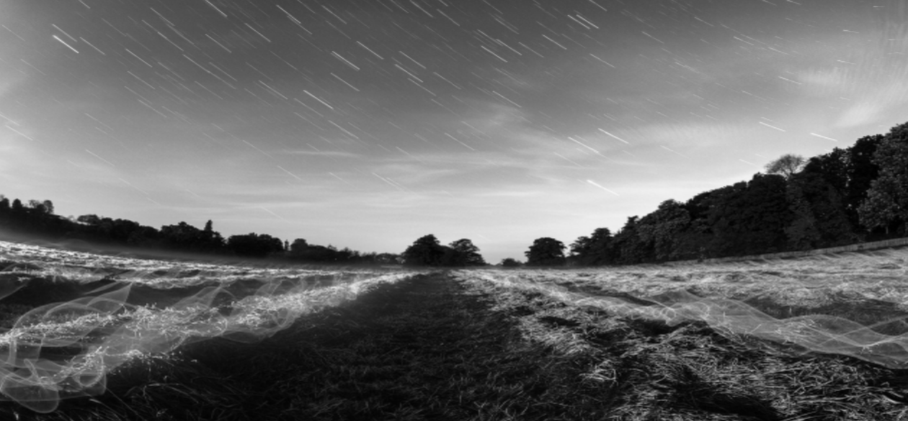

# Image Manipulation

C based program which takes .ppm image files and allows the user to edit them in several different ways. 

## Functions Allowed
* Flip Image Vertically or Horizontally
* Negate Image (Invert Colors)
* Rotate Image Right (Clockwise) or Left (Counter Clockwise)
* Darkenen or Brighten Image
* Increase Color Red, Green, or Blue
* Decrease Color Red, Green, or Blue
* Convert Image To Monochrome (Black & White)
* Undo All Changes

## Project Utilizes
* Matrices
* Heap
* Bitwise Operations
* Signedness
* File Opening, Editing, & Saving

## Program Walkthrough

## Functionality Showcase

### PLEASE NOTE: Images are in .png format because Github does not currently support .ppm files thus screenshots of the .ppm images were taken and saved as .png files so that they would be properly displayed in this showcase.

### Original Image

### Flip Vertically

### Flip Horizontally

### Negate Image (Invert Colors)

### Rotate Right

### Rotate Left

### Brighten Image

### Increase Color Red

### Increase Color Green

### Increase Color Blue

### Darken Image

### Decrease Reds

### Decrease Greens

### Decrease Blues

### Convert to Monochrome (Black & White)

